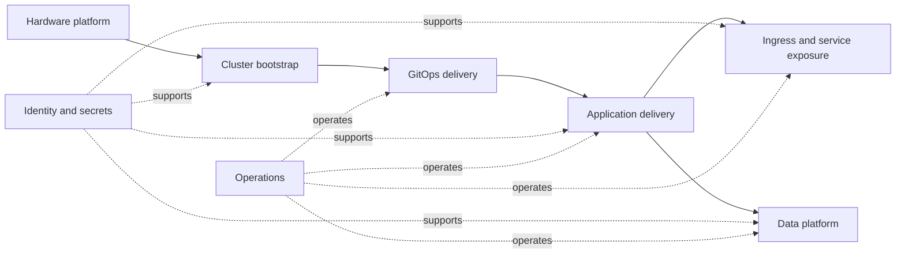
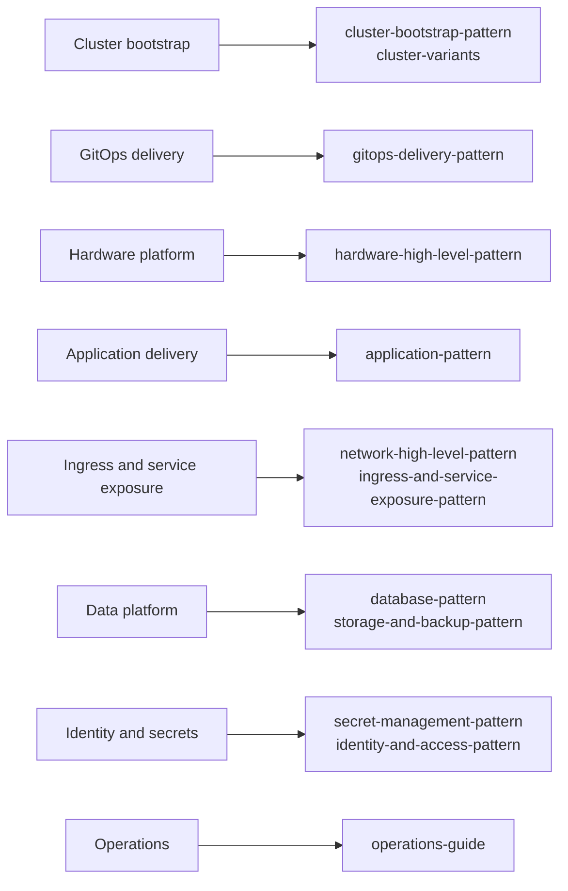

# Documentation Index

This folder contains architecture notes, reference documents, and reusable platform patterns for this repository.

## High-Level Building Blocks

### Architecture Map

### Document Mapping

## Architecture Patterns

- [`hardware-high-level-pattern.md`](./architecture/hardware-high-level-pattern.md)
  Reusable high-level view of gateways, Proxmox, cluster compute, NAS and backup endpoints, and supporting infrastructure roles.

- [`network-high-level-pattern.md`](./architecture/network-high-level-pattern.md)
  Reusable high-level network pattern for clusters such as `main`, `test`, and `registry`.

- [`secret-management-pattern.md`](./platform/secret-management-pattern.md)
  Pattern for handling bootstrap secrets, Vault-backed runtime secrets, and template-time secret injection.

- [`application-pattern.md`](./platform/application-pattern.md)
  Pattern for how a typical app is structured, parameterized, exposed, and connected to secrets and storage.

- [`cluster-bootstrap-pattern.md`](./architecture/cluster-bootstrap-pattern.md)
  Pattern for bringing up a cluster from Talos templates through initial platform bootstrap and GitOps handover.

- [`cluster-variants.md`](./architecture/cluster-variants.md)
  Summary of how `main`, `test`, and `registry` relate to the shared platform pattern.

- [`gitops-delivery-pattern.md`](./architecture/gitops-delivery-pattern.md)
  Pattern for bootstrap, Flux reconciliation, and layered application delivery.

- [`identity-and-access-pattern.md`](./platform/identity-and-access-pattern.md)
  Pattern for Authentik, LLDAP, gateway auth policies, and app-level OIDC integration.

- [`ingress-and-service-exposure-pattern.md`](./platform/ingress-and-service-exposure-pattern.md)
  Pattern for Envoy Gateway, service exposure, DNS automation, TLS, and Cloudflare integration.

- [`database-pattern.md`](./platform/database-pattern.md)
  Pattern for CloudNativePG, MariaDB, Dragonfly, database access, and database-specific backups.

- [`storage-and-backup-pattern.md`](./platform/storage-and-backup-pattern.md)
  Pattern for persistent storage, replication, object storage, and backup workflows.

## Operations

- [`operations-guide.md`](./operations/operations-guide.md)
  Compact index of common bootstrap, Flux, Talos, and database operations.

- [`taskfiles-pattern.md`](./operations/taskfiles-pattern.md)
  Pattern for how the root Taskfile and its namespaces structure operational workflows across the repository.

## Reference Documents

- [`redis-db-usage.md`](./reference/redis-db-usage.md)
  Notes about Redis database usage and allocation.

- [`network-ip-usage.md`](./reference/network-ip-usage.md)
  Inventory of network ranges, VIPs, service IPs, and node addresses.

## Suggested Reading Order

1. [`hardware-high-level-pattern.md`](./architecture/hardware-high-level-pattern.md)
2. [`network-high-level-pattern.md`](./architecture/network-high-level-pattern.md)
3. [`secret-management-pattern.md`](./platform/secret-management-pattern.md)
4. [`cluster-bootstrap-pattern.md`](./architecture/cluster-bootstrap-pattern.md)
5. [`gitops-delivery-pattern.md`](./architecture/gitops-delivery-pattern.md)
6. [`cluster-variants.md`](./architecture/cluster-variants.md)
7. [`application-pattern.md`](./platform/application-pattern.md)
8. [`identity-and-access-pattern.md`](./platform/identity-and-access-pattern.md)
9. [`ingress-and-service-exposure-pattern.md`](./platform/ingress-and-service-exposure-pattern.md)
10. [`database-pattern.md`](./platform/database-pattern.md)
11. [`storage-and-backup-pattern.md`](./platform/storage-and-backup-pattern.md)

## Notes

- Pattern documents describe reusable architectural approaches, not exact one-to-one inventories.
- Reference documents capture concrete values, allocations, or implementation-specific details.
