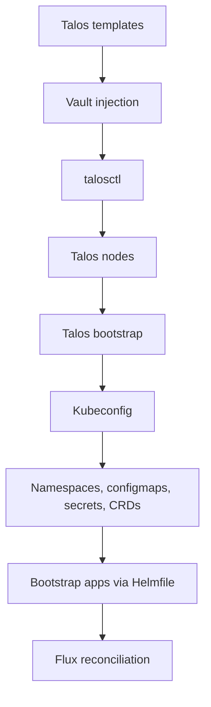

# Cluster Bootstrap Pattern

This document describes the reusable cluster bootstrap pattern used in this repository. The pattern combines Talos machine configuration, Kubernetes bootstrap, kubeconfig generation, and initial platform bring-up before steady-state GitOps takes over.

## Pattern Overview

- Talos machine configurations are rendered from cluster and node templates.
- Vault-backed placeholders are resolved before Talos configuration is applied.
- Talos bootstraps Kubernetes on the control plane and then produces the cluster kubeconfig.
- Initial namespaces, configmaps, secrets, CRDs, and bootstrap apps are applied before normal GitOps reconciliation takes over.
- After bootstrap, Flux becomes the steady-state delivery mechanism.

## Core Building Blocks

- Talos machine config templates live under `talos/<cluster>/`.
- `scripts/render-machine-config.sh` renders and patches machine configs.
- `scripts/bootstrap-talos.sh` applies Talos config, bootstraps Kubernetes, and fetches kubeconfig.
- `scripts/bootstrap-talos-apps.sh` applies namespaces, configmaps, secrets, CRDs, and initial app Helmfiles.
- Talos operational entrypoints are exposed through the `task talos:*` namespace.

## Bootstrap Flow

### 1. Talos Configuration Flow

- Cluster-level and node-level Talos templates are rendered for each node.
- Vault placeholders are resolved during render time.
- `talosctl apply-config` is attempted securely first, then retried with `--insecure` for maintenance-mode nodes if needed.

### 2. Kubernetes Bootstrap Flow

- Once control-plane configuration is applied, Talos bootstraps Kubernetes on the selected controller endpoint.
- The bootstrap step is retried until the cluster is ready or a trust mismatch is detected.
- After bootstrap succeeds, a kubeconfig is written into `kubernetes/clusters/<cluster>`.

### 3. Initial Platform Bring-Up Flow

- Cluster namespaces are applied first.
- Cluster settings configmaps and early secrets are applied next.
- CRDs are installed before app-level resources that depend on them.
- Bootstrap Helmfiles install foundational components needed for the cluster to self-manage.

### 4. GitOps Handover Flow

- Once bootstrap apps and Flux are available, ongoing reconciliation is Git-driven.
- Day-two changes should generally happen through Git and Flux rather than through direct imperative apply operations.

## Typical Repository Pattern

- Talos bootstrap logic lives in [`scripts/bootstrap-talos.sh`](../../scripts/bootstrap-talos.sh).
- Initial app bootstrap logic lives in [`scripts/bootstrap-talos-apps.sh`](../../scripts/bootstrap-talos-apps.sh).
- Talos operational tasks are documented in [`.taskfiles/Talos/README.md`](../../.taskfiles/Talos/README.md).
- Cluster machine templates live below [`talos/main`](../../talos/main).
- Initial bootstrap Helm releases live in [`bootstrap/helmfile.yaml`](../../bootstrap/helmfile.yaml) and [`bootstrap/main/helmfile.d`](../../bootstrap/main/helmfile.d).

## Design Intent

- Separate machine bootstrap from steady-state cluster reconciliation.
- Keep cluster creation reproducible from templates and version-controlled scripts.
- Apply only the minimum imperative setup needed before GitOps can take over.
- Support the same bootstrap shape across multiple clusters with different sizes and roles.
