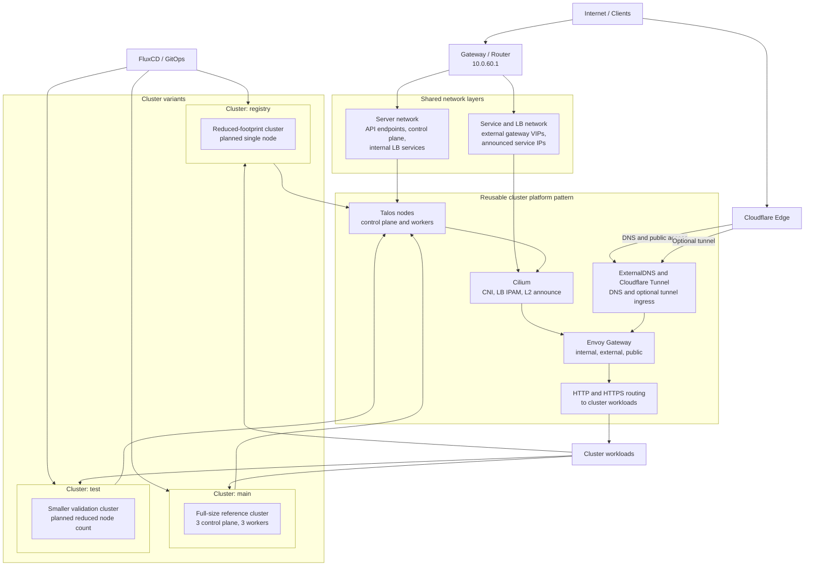

# High-Level Network Pattern

This diagram shows a reusable high-level network pattern for Kubernetes clusters in this repository. The `main` cluster acts as the reference implementation, while `test` and `registry` are planned variants with a smaller footprint and cluster-specific service exposure.

## Summary

- The diagram represents a reusable cluster pattern rather than an exact one-to-one inventory of a single environment.
- The same core building blocks can be reused across clusters: Talos, Cilium, Envoy Gateway, ExternalDNS, and optional Cloudflare Tunnel exposure.
- `main` is the reference implementation, while `test` and `registry` are smaller planned variants of the same overall pattern.
- The server network typically carries cluster API endpoints, control-plane traffic, and internal LoadBalancer services.
- The service and LB network typically carries externally announced gateway VIPs and service IP pools.
- The diagram is intentionally simplified for architecture documentation and presentations, not for node-by-node operational detail.

