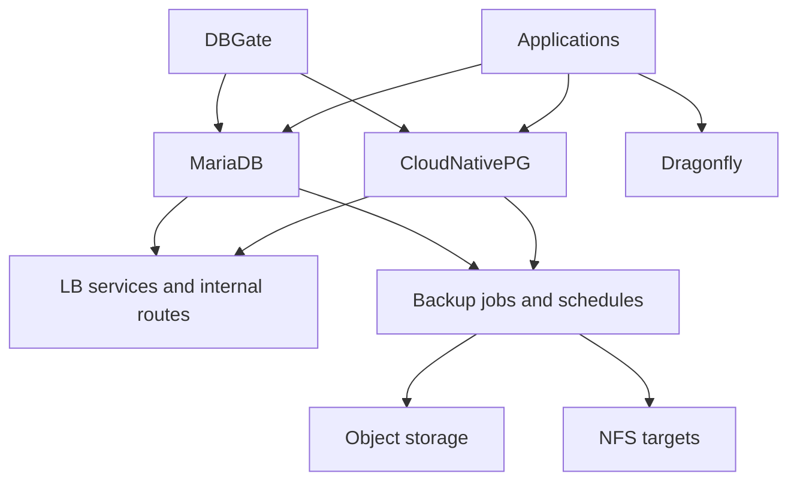

# Database Pattern

This document describes the reusable database pattern used in this repository. The pattern combines operator-managed PostgreSQL, MariaDB, Dragonfly, supporting access services, and database-specific backup workflows.

## Pattern Overview

- PostgreSQL is primarily handled through CloudNativePG.
- MariaDB is managed separately with its own deployment and backup flow.
- Dragonfly provides the Redis-compatible data layer used by multiple apps.
- Supporting access patterns include internal LoadBalancer services and database-facing tools such as DBGate.
- Backup strategy depends on the database engine and operator capabilities.

## Core Building Blocks

- `CloudNativePG` provides operator-managed PostgreSQL clusters.
- `Barman cloud` integration enables object-storage-backed PostgreSQL backups.
- `MariaDB` is deployed separately and paired with its own backup resources.
- `Dragonfly` provides Redis-compatible services for app caches and state.
- `DBGate` provides a management UI for supported database services.

## Database Flows

### 1. PostgreSQL Flow

- The CloudNativePG operator is installed first.
- Cluster-specific PostgreSQL clusters are then created with storage, service IP, and replica settings.
- Optional backup Kustomizations follow the main cluster deployment and write backup data to configured targets.

### 2. MariaDB Flow

- MariaDB is deployed as a separate cluster app with explicit storage and LoadBalancer settings.
- A follow-up backup Kustomization handles MariaDB backup behavior.
- This keeps the lifecycle separate from PostgreSQL-specific operator logic.

### 3. Dragonfly Flow

- Dragonfly is deployed through an operator and then reconciled as a cluster resource.
- Applications consume allocated Redis databases from the shared Dragonfly instance.
- Actual database allocation is tracked separately in a reference document.

### 4. Access Flow

- Internal LoadBalancer services expose selected databases at stable cluster IPs.
- Some supporting tools, such as DBGate, provide operator-facing access.
- Application connectivity remains declarative through shared secrets and service naming.

## Typical Repository Pattern

- CloudNativePG orchestration lives in [`kubernetes/apps/main/database/cloudnative-pg.yaml`](../kubernetes/apps/main/database/cloudnative-pg.yaml).
- MariaDB orchestration lives in [`kubernetes/apps/main/database/mariadb.yaml`](../kubernetes/apps/main/database/mariadb.yaml).
- Dragonfly orchestration lives in [`kubernetes/apps/main/database/dragonfly.yaml`](../kubernetes/apps/main/database/dragonfly.yaml).
- Database operations are documented in [`.taskfiles/Database/README.md`](../.taskfiles/Database/README.md).
- Redis allocation reference lives in [`docs/redis-db-usage.md`](./redis-db-usage.md).

## Design Intent

- Use the right operational model for each database engine instead of forcing one generic abstraction.
- Keep database provisioning, backup, and access declarative.
- Separate runtime app connectivity from operator-specific lifecycle and backup concerns.
- Allow shared database services to be reused across many apps while still tracking ownership and allocation.
