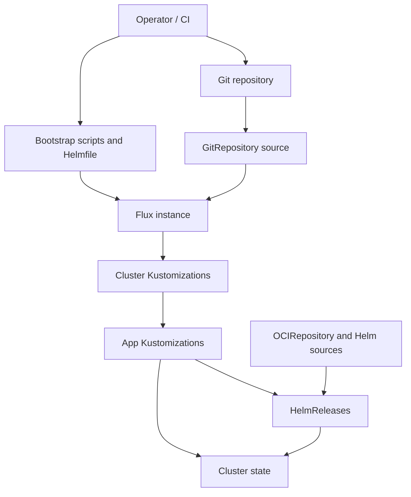

# GitOps Delivery Pattern

This document describes the reusable GitOps delivery pattern used in this repository. The pattern combines bootstrap-time installation, Flux-based reconciliation, and layered Kustomization and HelmRelease composition.

## Pattern Overview

- Bootstrap installs the foundational controllers and secrets needed for GitOps.
- Flux watches the repository and reconciles cluster-scoped entrypoints.
- Cluster-level Flux `Kustomization` resources fan out into app-level `Kustomization` and `HelmRelease` resources.
- Runtime reconciliation becomes declarative and continuous after bootstrap is complete.

## Core Building Blocks

- Bootstrap is driven by `task`, shell scripts, and `helmfile`.
- Flux is installed as an operator-managed instance and configured to sync from Git.
- The cluster entrypoint is a Flux `Kustomization` that targets `kubernetes/clusters/<cluster>`.
- App delivery uses layered Flux `Kustomization` resources that point into `kubernetes/apps/<cluster>`.
- Helm-based apps are managed through `HelmRelease` resources backed by `OCIRepository` or Helm repository sources.

## Delivery Flow

### 1. Bootstrap Flow

- Bootstrap installs foundational components such as `cert-manager`, `external-secrets`, `flux-operator`, and the Flux instance.
- Bootstrap also applies initial secrets and settings that Flux depends on.
- This creates the minimum viable control plane for self-managed GitOps reconciliation.

### 2. Source and Reconciliation Flow

- Flux syncs the repository from the configured branch and path.
- The Flux instance points at the cluster-specific path under `kubernetes/clusters/main`.
- The cluster entrypoint then reconciles the cluster app tree under `kubernetes/apps/main`.

### 3. App Delivery Flow

- Cluster-level Kustomizations apply shared defaults such as SOPS decryption and Helm remediation behavior.
- Child Kustomizations select app paths and compose optional shared components.
- `HelmRelease` resources deploy chart-based applications once their dependencies and sources are ready.

## Typical Repository Pattern

- Bootstrap orchestration is defined in [`bootstrap/helmfile.yaml`](../bootstrap/helmfile.yaml).
- Flux operational tasks live in [`.taskfiles/Flux/Taskfile.yaml`](../.taskfiles/Flux/Taskfile.yaml).
- The cluster app entrypoint is [`kubernetes/clusters/main/apps.yaml`](../kubernetes/clusters/main/apps.yaml).
- The Flux instance configuration lives in [`kubernetes/clusters/main/flux-instance/helmrelease.yaml`](../kubernetes/clusters/main/flux-instance/helmrelease.yaml).
- Cluster workloads are organized below [`kubernetes/apps/main`](../kubernetes/apps/main).

## Design Intent

- Keep cluster state declarative and Git-driven after initial bootstrap.
- Separate one-time bootstrap concerns from steady-state reconciliation.
- Apply shared reconciliation defaults centrally at the cluster entrypoint.
- Allow applications to mix plain manifests, Kustomize overlays, reusable components, and Helm-based delivery.
- Reuse the same overall pattern across multiple clusters with different app sets and sizes.
