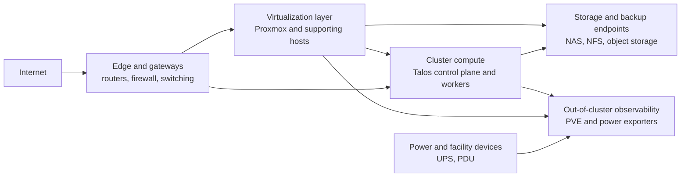

# Hardware High-Level Pattern

This document describes the reusable high-level hardware and platform pattern behind this repository. It focuses on infrastructure roles and relationships such as gateways, virtualization, cluster compute, storage, and backup endpoints rather than on a full host inventory.

## Pattern Overview

- The edge layer provides routing, firewalling, and network segmentation.
- Proxmox and related host infrastructure provide virtualization and supporting compute outside the cluster itself.
- The Kubernetes platform runs on Talos-managed control-plane and worker nodes.
- Storage and backup targets such as NAS, NFS exports, and object-storage services support both applications and operational workflows.
- Power and infrastructure devices are part of the broader platform and can be observed from inside the cluster.

## Core Building Blocks

- `Routers and gateways` provide the primary network edge.
- `Switches` provide the physical network fabric and management plane.
- `Proxmox` represents the virtualization layer for platform services and non-cluster workloads.
- `Talos nodes` host the Kubernetes control plane and worker workloads.
- `NAS and NFS targets` provide backup and shared storage endpoints.
- `Object storage` supports backup and platform data flows.
- `UPS and power devices` support operational visibility and resilience.

## Infrastructure Role Flows

### 1. Edge And Network Flow

- Traffic enters through the router and gateway layer.
- Internal and service networks are segmented and routed at the edge.
- Cluster-exposed services depend on these network boundaries and VIPs.

### 2. Virtualization And Compute Flow

- Proxmox hosts or supports platform workloads outside Kubernetes.
- Talos nodes provide the dedicated compute layer for the cluster itself.
- Together they form the compute substrate for both cluster and non-cluster services.

### 3. Storage And Backup Flow

- The cluster consumes NFS and other external storage endpoints for backups and shared data flows.
- Backup destinations may live on NAS infrastructure outside the cluster.
- Object storage inside the platform can complement external backup targets.

### 4. Observability And Power Flow

- Exporters inside the cluster observe infrastructure outside the cluster, such as Proxmox and UPS devices.
- This creates a useful feedback loop where Kubernetes-based observability monitors the broader hardware platform.

## Typical Repository Pattern

- Network ranges, node IPs, and VIPs are documented in [`docs/network-ip-usage.md`](./network-ip-usage.md).
- Talos cluster node templates live below [`talos/main`](../talos/main).
- PVE observability is wired through [`kubernetes/apps/main/observability/exporters/pve-exporter.yaml`](../kubernetes/apps/main/observability/exporters/pve-exporter.yaml).
- UPS and power observability is wired through [`kubernetes/apps/main/observability/exporters/nut-exporter.yaml`](../kubernetes/apps/main/observability/exporters/nut-exporter.yaml).
- NAS-related backup jobs are wired through [`kubernetes/apps/main/jobs/nas-backup.yaml`](../kubernetes/apps/main/jobs/nas-backup.yaml).

## Relationship To Other Patterns

- [`network-high-level-pattern.md`](./network-high-level-pattern.md) explains the logical cluster networking on top of this hardware platform.
- [`cluster-bootstrap-pattern.md`](./cluster-bootstrap-pattern.md) explains how the Talos and Kubernetes layer is brought up on the compute substrate.
- [`storage-and-backup-pattern.md`](./storage-and-backup-pattern.md) explains how storage and backup workflows use the available endpoints.
- [`ingress-and-service-exposure-pattern.md`](./ingress-and-service-exposure-pattern.md) explains how services are exposed through the network edge.

## Design Intent

- Show how the Kubernetes platform relates to the surrounding hardware estate.
- Keep the description role-based and reusable instead of inventory-heavy.
- Make external dependencies such as gateways, virtualization, NAS, and power infrastructure visible in the architecture.
- Bridge the gap between hardware topology and the logical platform patterns documented elsewhere.
