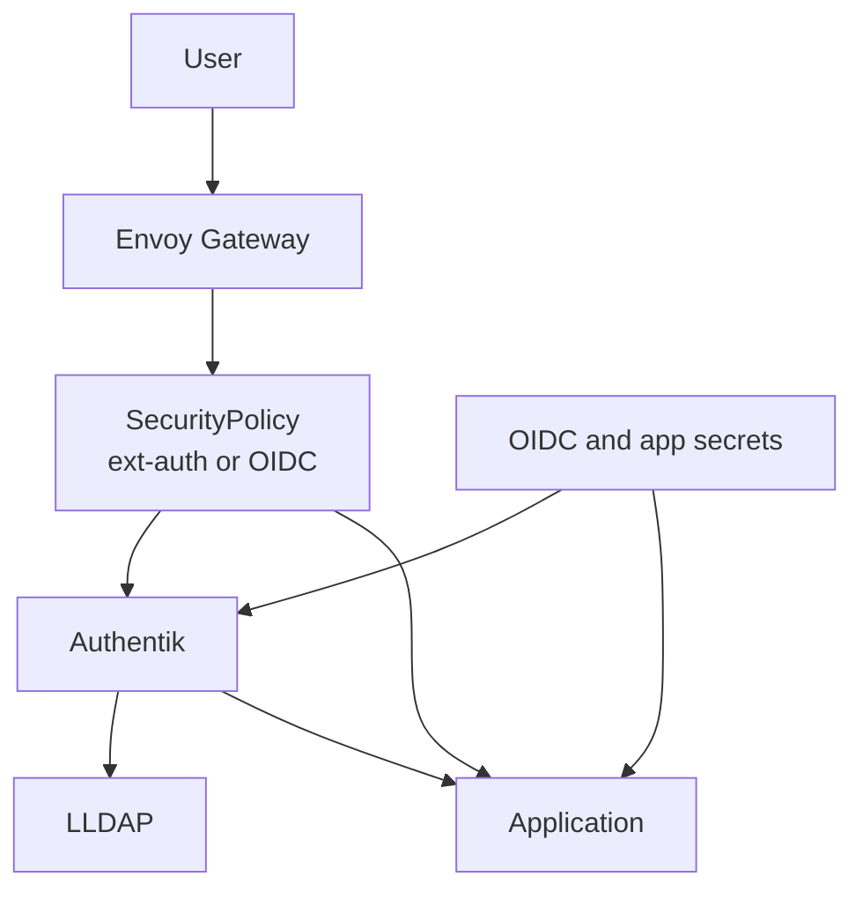

# Identity And Access Pattern

This document describes the reusable identity and access pattern used in this repository. The pattern combines Authentik, LLDAP, Envoy Gateway auth policies, and application-level OIDC integrations.

## Pattern Overview

- Authentik acts as the central identity provider for interactive access.
- LLDAP provides a lightweight directory backend for identity data and group membership.
- Envoy Gateway can enforce access either through external auth policies or native OIDC policies.
- Applications may integrate with Authentik directly or rely on gateway-level protection in front of them.
- Group claims are used for role and access decisions where supported.

## Core Building Blocks

- `authentik` is deployed as the identity provider.
- `lldap` is deployed as a directory service and group source.
- Envoy auth is implemented through reusable security policy components under `kubernetes/components/envoy`.
- OIDC wrappers exist for different domain variants such as `main`, `base`, `dev`, `game`, and `internal`.
- Application secrets and OIDC client credentials are sourced from Vault via `ExternalSecret`.

## Access Flows

### 1. Gateway-Level Protection Flow

- A user request first reaches Envoy Gateway.
- An attached `SecurityPolicy` enforces either ext-auth or OIDC behavior for the protected route.
- Envoy consults Authentik before allowing access to the upstream application.
- This pattern keeps access control centralized and reusable across apps.

### 2. Direct Application OIDC Flow

- Some applications integrate directly with Authentik as an OIDC provider.
- The application consumes OIDC client credentials and evaluates user claims such as groups or roles.
- This is useful when the application needs first-class identity awareness rather than only gateway protection.

### 3. Directory And Group Flow

- LLDAP stores or backs the user and group model used by the identity layer.
- Authentik can use directory-backed identities and expose group claims downstream.
- Applications and policies can then map those groups to authorization behavior.

## Typical Repository Pattern

- Authentik is wired through [`kubernetes/apps/main/security/authentik.yaml`](../kubernetes/apps/main/security/authentik.yaml).
- LLDAP is wired through [`kubernetes/apps/main/security/lldap.yaml`](../kubernetes/apps/main/security/lldap.yaml).
- Reusable Envoy OIDC wrappers are documented in [`kubernetes/components/envoy/oidc/authentik/README.md`](../kubernetes/components/envoy/oidc/authentik/README.md).
- Gateway ext-auth policy lives under [`kubernetes/components/envoy/ext-auth`](../kubernetes/components/envoy/ext-auth).
- Example app-level OIDC adoption appears in app configs such as [`kubernetes/apps/base/llm/open-webui/helmrelease.yaml`](../kubernetes/apps/base/llm/open-webui/helmrelease.yaml).

## Design Intent

- Centralize authentication and access policy rather than reimplementing it per app.
- Support both gateway-enforced auth and direct application OIDC, depending on app capability.
- Reuse the same policy model across multiple domains and cluster contexts.
- Keep credentials declarative and externally sourced through the secret management pattern.
