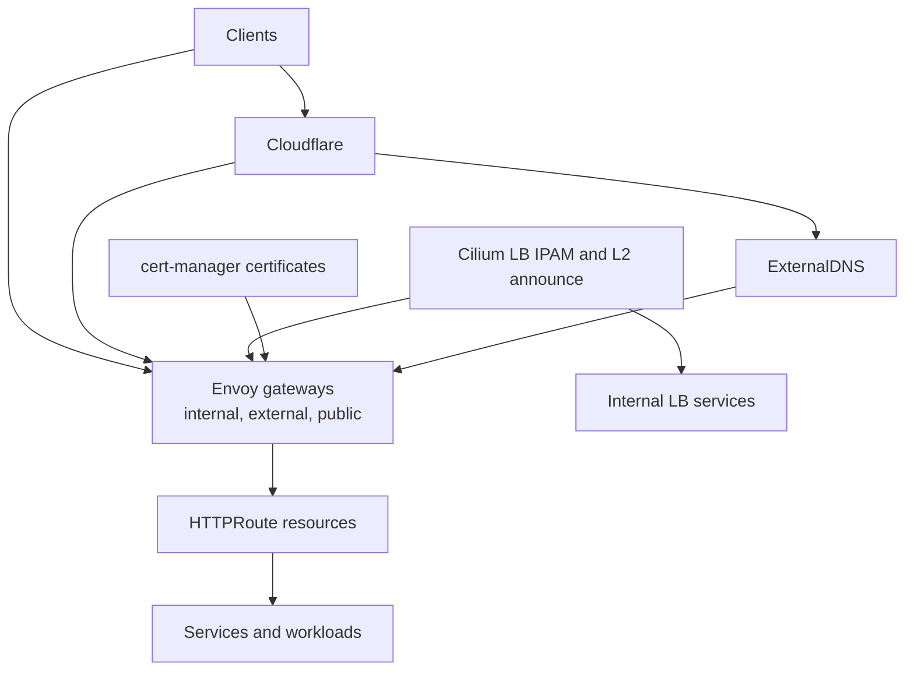

# Ingress And Service Exposure Pattern

This document describes the reusable ingress and service exposure pattern used in this repository. The pattern combines Envoy Gateway, Cilium LoadBalancer IP allocation and L2 announcement, ExternalDNS, certificates, and optional Cloudflare tunnel access.

## Pattern Overview

- Envoy Gateway is the primary HTTP and HTTPS exposure layer.
- Different gateways separate internal, external, and public traffic classes.
- Cilium assigns service IPs and announces them onto the appropriate network segments.
- ExternalDNS derives DNS records from gateway, route, and service resources.
- cert-manager provides the TLS certificates consumed by the gateways.
- Cloudflare can participate either as the public DNS edge or as a tunnel-based access path.

## Core Building Blocks

- `GatewayClass` and `Gateway` resources define the exposure tiers.
- `HTTPRoute` resources attach applications to the selected gateway.
- `CiliumLoadBalancerIPPool` and `CiliumL2AnnouncementPolicy` provide service IP allocation and announcement.
- `ExternalDNS` watches gateway and service resources and updates DNS providers.
- `cert-manager` issues the certificates used by internal and external listeners.
- `cloudflare-tunnel` provides an optional outbound path for selected exposure scenarios.

## Exposure Flow

### 1. Gateway Provisioning Flow

- Envoy Gateway creates internal, external, and public gateway instances.
- Gateway infrastructure annotations request specific Cilium-managed VIPs.
- Gateway listeners terminate HTTP and HTTPS and reference the expected TLS secrets.

### 2. Routing Flow

- Applications expose themselves through `HTTPRoute` resources.
- Routes attach to the intended gateway, for example internal-only or externally reachable.
- Shared policies such as redirects, auth, and traffic behavior can be applied at the gateway layer.

### 3. DNS And Certificate Flow

- ExternalDNS reads hostnames and targets from gateways, routes, and services.
- cert-manager issues the certificate secrets that HTTPS listeners consume.
- Cloudflare-backed or other provider-backed DNS then resolves clients to the relevant VIPs.

### 4. Service LoadBalancer Flow

- Cilium allocates IPs from configured service pools.
- L2 announcement policies ensure the correct nodes advertise the correct VIPs on the correct interfaces.
- Non-HTTP services can also be exposed directly as `LoadBalancer` services outside the gateway path.

## Typical Repository Pattern

- Gateway definitions live in [`kubernetes/apps/main/network/envoy-gateway/envoy.yaml`](../kubernetes/apps/main/network/envoy-gateway/envoy.yaml).
- Cilium LB pools and L2 announcement policy live in [`kubernetes/apps/main/kube-system/cilium/networking.yaml`](../kubernetes/apps/main/kube-system/cilium/networking.yaml).
- Network platform components are grouped under [`kubernetes/apps/base/network`](../kubernetes/apps/base/network).
- Cluster certificate wiring is grouped under [`kubernetes/apps/main/network/certificates.yaml`](../kubernetes/apps/main/network/certificates.yaml).
- Network IP usage is documented in [`docs/network-ip-usage.md`](./network-ip-usage.md).

## Design Intent

- Use one consistent HTTP and HTTPS exposure model across applications.
- Keep internal, external, and public access classes separate.
- Make IP allocation and service announcement explicit and policy-driven.
- Keep DNS and certificate management declarative and attached to the exposed resource model.
- Support both direct LAN exposure and Cloudflare-mediated access paths.
