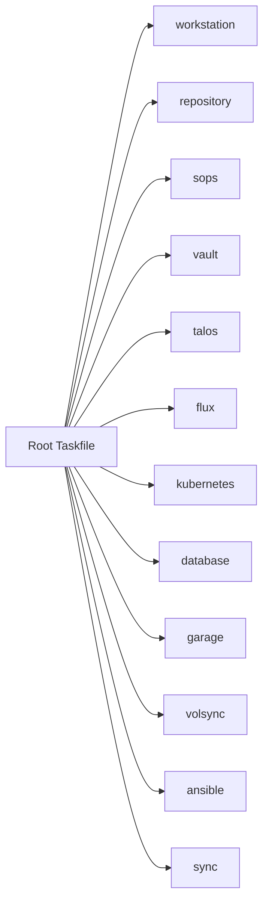

# Taskfiles Pattern

This document describes the role of Taskfiles in this repository. The Taskfile layer acts as the operational command surface for bootstrap, GitOps, platform management, and day-two workflows.

## Pattern Overview

- The root `Taskfile.yaml` acts as the single entrypoint for operational commands.
- Task namespaces map operational concerns to focused sub-Taskfiles.
- This keeps workflows discoverable while avoiding one monolithic task catalog.
- Taskfiles complement GitOps by handling bootstrap, diagnostics, controlled imperative actions, and local operator workflows.

## Core Building Blocks

- `workstation`
  Local environment setup and tooling preparation.

- `repository`
  Repo initialization and configuration workflows.

- `sops` and `vault`
  Secret management helpers, encryption, and `vault://` workflows.

- `talos`
  Cluster bootstrap, node configuration, diagnostics, reboot, and reset tasks.

- `flux`
  Reconcile, monitor, and sync workflows for GitOps controllers and resources.

- `kubernetes`
  Cluster-facing operational helpers outside the narrower Flux and Talos scopes.

- `database`
  Operational helpers for CNPG, MariaDB, MongoDB, and related database tasks.

- `garage` and `volsync`
  Object storage and backup-related operational workflows.

- `ansible` and `sync`
  Supporting automation and synchronization tasks.

## Operational Role Flows

### 1. Bootstrap Flow

- Repository and workstation tasks prepare the operator environment.
- Secret-related tasks provide encryption and Vault access helpers.
- Talos tasks bootstrap the cluster infrastructure.
- Flux tasks and bootstrap scripts then hand over to GitOps-based reconciliation.

### 2. Day-Two Platform Flow

- Flux tasks handle reconcile, monitor, and resource sync operations.
- Talos tasks handle machine-level changes and cluster-level node operations.
- Kubernetes and database tasks support workload inspection and controlled maintenance actions.

### 3. Supporting Services Flow

- Garage tasks support object-storage administration.
- VolSync tasks support backup-related operational workflows.
- Vault and SOPS tasks support secrets-related maintenance without embedding those steps into every other namespace.

## Typical Repository Pattern

- The root task entrypoint lives in [`Taskfile.yaml`](../../Taskfile.yaml).
- Flux tasks live in [`.taskfiles/Flux/Taskfile.yaml`](../../.taskfiles/Flux/Taskfile.yaml).
- Talos tasks live in [`.taskfiles/Talos/Taskfile.yaml`](../../.taskfiles/Talos/Taskfile.yaml).
- Database tasks live in [`.taskfiles/Database/Taskfile.yaml`](../../.taskfiles/Database/Taskfile.yaml).
- Garage tasks live in [`.taskfiles/Garage/Taskfile.yaml`](../../.taskfiles/Garage/Taskfile.yaml).
- Vault tasks live in [`.taskfiles/Vault/Taskfile.yaml`](../../.taskfiles/Vault/Taskfile.yaml).

## Design Intent

- Present one consistent operational interface for the whole repository.
- Keep commands grouped by platform concern instead of by implementation detail.
- Support both bootstrap-time and steady-state operational workflows.
- Make it easier for operators to discover the correct command namespace for a task.
