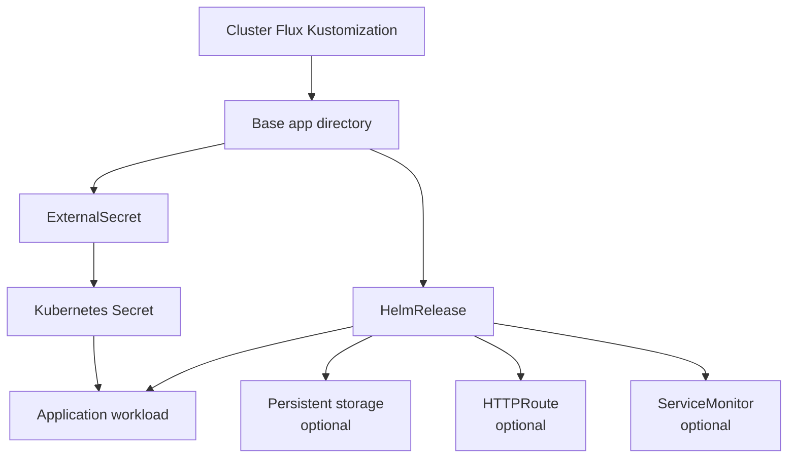

# Application Pattern

This document describes the reusable application deployment pattern used in this repository. The pattern combines a cluster-specific Flux `Kustomization`, a reusable base application directory, optional secret and storage components, and a chart-driven workload definition.

## Pattern Overview

- A cluster-specific Flux `Kustomization` points at a reusable base application directory.
- The base directory usually contains a `kustomization.yaml`, an `externalsecret.yaml`, and a `helmrelease.yaml`.
- Runtime secrets are typically delivered through `ExternalSecret`.
- Workload behavior, routing, persistence, and monitoring are usually declared inside the `HelmRelease`.
- Shared behavior is parameterized through Flux `postBuild.substitute` values such as `APP`, `CLUSTER`, `GATEWAY`, and storage settings.

## Core Building Blocks

- A cluster-level Flux `Kustomization` under `kubernetes/apps/<cluster>/...` selects the app and injects cluster-specific values.
- A base app directory under `kubernetes/apps/base/...` defines the reusable application pattern.
- `ExternalSecret` is commonly used to materialize runtime credentials from Vault.
- `HelmRelease` is commonly used for app deployment, often via the shared `app-template` chart.
- Optional storage can be defined directly in chart values or through reusable PVC components.
- Optional route and monitoring resources are usually expressed through chart values such as `route` and `serviceMonitor`.

## Typical Flow

### 1. Cluster Selection Flow

- A cluster-specific `Kustomization` selects the base app path.
- It injects environment-specific substitutions such as `CLUSTER`, `GATEWAY`, `VOL_CAPACITY`, or secret-derived values.
- This keeps the app definition reusable while allowing per-cluster overrides.

### 2. Base Application Composition Flow

- The base app `kustomization.yaml` usually references `externalsecret.yaml` and `helmrelease.yaml`.
- This gives each app a predictable structure and keeps the dependency graph easy to follow.
- Additional components such as backup, migration, or auth can be added when needed.

### 3. Runtime Delivery Flow

- `ExternalSecret` creates a Kubernetes `Secret` for the app, usually using the `${CLUSTER}/${APP}` lookup pattern.
- `HelmRelease` deploys the workload and consumes the generated secret through `envFrom` or other references.
- The same Helm release typically defines the service, route, persistence, and health behavior.

### 4. Exposure And Persistence Flow

- If the app is user-facing, the Helm release usually declares an HTTP route to an Envoy gateway.
- If the app is stateful, the Helm release usually declares a PVC-backed persistence block.
- If the app exports metrics, the Helm release may also define a `ServiceMonitor`.

## Typical Repository Pattern

- A cluster-specific app wrapper looks like [`kubernetes/apps/main/llm/open-webui.yaml`](../../kubernetes/apps/main/llm/open-webui.yaml).
- A typical base app directory looks like [`kubernetes/apps/base/llm/open-webui`](../../kubernetes/apps/base/llm/open-webui).
- The reusable app secret pattern is implemented in [`kubernetes/components/external-secret/external-secret.yaml`](../../kubernetes/components/external-secret/external-secret.yaml).
- A reusable PVC pattern exists in [`kubernetes/components/vol/pvc.yaml`](../../kubernetes/components/vol/pvc.yaml).
- Representative app examples include [`kubernetes/apps/base/llm/open-webui/helmrelease.yaml`](../../kubernetes/apps/base/llm/open-webui/helmrelease.yaml), [`kubernetes/apps/base/self-hosted/mealie/helmrelease.yaml`](../../kubernetes/apps/base/self-hosted/mealie/helmrelease.yaml), and [`kubernetes/apps/base/maker/spoolman/helmrelease.yaml`](../../kubernetes/apps/base/maker/spoolman/helmrelease.yaml).

## Design Intent

- Keep app structure predictable across namespaces and categories.
- Separate cluster-specific values from reusable base application definitions.
- Standardize the common app concerns: secret delivery, routing, persistence, and observability.
- Allow apps to stay simple by using shared components and chart conventions.
- Make it easy to promote the same application pattern to additional clusters with minimal duplication.
