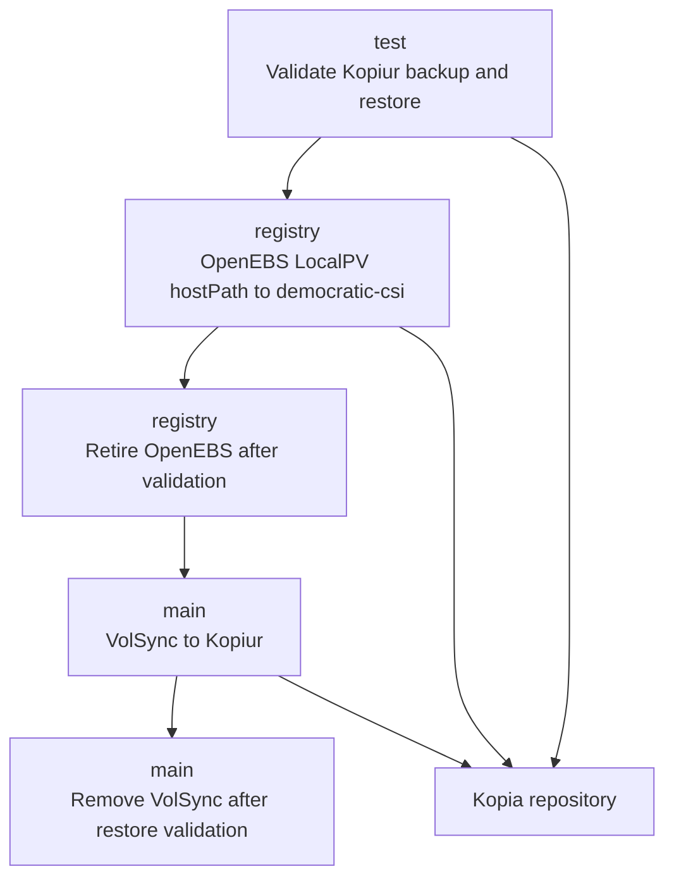

# Storage And Backup Migration

This document describes the staged migration of storage and backup tooling across the `test`, `registry`, and `main` clusters. Kopiur backup and restore validation precedes the registry storage migration and the replacement of VolSync in main.



## Migration Overview

- Validate Kopiur in `test` before relying on it for other clusters.
- Move `registry` workloads from OpenEBS LocalPV hostPath to new democratic-csi PVCs through Kopiur backup and restore.
- Replace VolSync with Kopiur in `main` while keeping Longhorn as the storage backend.
- Complete each phase independently and validate restored data before proceeding.
- Apply storage and workload configuration changes through Git and Flux.

## Core Building Blocks

- `Kopiur` orchestrates PVC backup and restore workflows.
- `Kopia` stores the backup snapshots used for restore and migration.
- `OpenEBS LocalPV hostPath` provides the existing node-local registry volumes.
- `democratic-csi` provisions the replacement registry volumes.
- `Longhorn` continues providing primary storage in main.
- `VolSync` remains available during main backup validation and is removed workload by workload.

## Commands

Run tasks from the repository root. `cluster` is an explicit kubeconfig context; `app` is the Kopiur SnapshotPolicy name; `ns`, `claim`, and `snapshot` select the namespace, source PVC, and snapshot. Uppercase shell variables below supply values to these lowercase task parameters. Replace placeholder values before running commands. The migration restore creates a new filesystem PVC with the source access modes and provisioned capacity, and refuses an existing target. Source and snapshot must belong to the same namespace and a single-source policy. A failed restore leaves its resources available for inspection; inspect them before retrying with a fresh target name.

<details>
<summary>Set workload parameters</summary>

```bash
export cluster=test
export NS='<namespace>'
export APP='<snapshot-policy>'
export PVC='<source-pvc>'
export TARGET='<new-pvc>'
export STORAGECLASS='<target-storage-class>'
export WORKLOAD='deployment/<name>'
export SELECTOR='app.kubernetes.io/name=<name>'
export KS='<owning-kustomization>'
export KS_NS='<kustomization-namespace>'
export HR='<owning-helmrelease>'
export REPLICAS='<original-count>'
export CHECK_POD='<temporary-validation-pod>'
export MOUNT_PATH='/data'
```

</details>

## Migration Flows

### 1. Test Backup And Restore Flow

- Verify Kopiur CRDs, controller health, and repository readiness.
- Select a disposable PVC or a non-critical application with known test data.
- Record a marker, file checksums, ownership, and permissions before backup. Include nested directories and links where relevant.
- Use direct data transfer for OpenEBS hostPath or storage without a portable CSI snapshot mechanism.
- Run a backup and verify the snapshot completes successfully in the configured Kopia repository. Inspect mover jobs and logs if it fails.
- Restore into a separate PVC, explicitly selecting the target StorageClass when testing a different backend.
- Mount the restored PVC in a temporary pod and compare its contents and checksums with the source.
- Validate ownership, permissions, links, timestamps, ACLs, and extended attributes where required by the workload.
- Start the application against the restored volume where applicable.


<details>
<summary>Check components and create a test backup</summary>

```bash
task kopiur:status cluster="$cluster"
kubectl --context "$cluster" get crd | rg kopiur
kubectl --context "$cluster" get pods -A | rg kopiur
kubectl --context "$cluster" -n "$NS" get snapshotpolicy "$APP" -o yaml
# Run inside the source pod at the actual volume mount path.
kubectl --context "$cluster" -n "$NS" exec '<source-pod>' -- sh -c \
  'cd /data && find . -type f -exec sha256sum {} \; | sort' > /tmp/migration-source-checksums.txt
task migration:snapshot cluster="$cluster" ns="$NS" app="$APP"
task kopiur:snapshots cluster="$cluster" ns="$NS" app="$APP"
```

</details>

<details>
<summary>Restore and mount a separate test PVC</summary>

Use the same validation commands for the registry restore. Check workload-specific metadata and application behavior separately.

```bash
export SNAPSHOT='<successful-snapshot-name>'
task migration:restore cluster="$cluster" ns="$NS" claim="$PVC" TARGET="$TARGET" STORAGECLASS="$STORAGECLASS" snapshot="$SNAPSHOT"
kubectl --context "$cluster" -n "$NS" run "$CHECK_POD" --image=alpine:3.22 --restart=Never \
  --overrides="$(jq -n --arg pvc "$TARGET" '{spec:{containers:[{name:"check",image:"alpine:3.22",command:["sleep","infinity"],volumeMounts:[{name:"data",mountPath:"/data"}]}],volumes:[{name:"data",persistentVolumeClaim:{claimName:$pvc}}]}}')"
kubectl --context "$cluster" -n "$NS" wait pod/"$CHECK_POD" --for=condition=Ready --timeout=5m
kubectl --context "$cluster" -n "$NS" exec "$CHECK_POD" -- sh -c \
  'cd /data && find . -type f -exec sha256sum {} \; | sort' > /tmp/migration-target-checksums.txt
diff -u /tmp/migration-source-checksums.txt /tmp/migration-target-checksums.txt
kubectl --context "$cluster" -n "$NS" exec "$CHECK_POD" -- ls -lan /data
kubectl --context "$cluster" -n "$NS" delete pod "$CHECK_POD"
```

</details>

The phase is complete when the repository, backup, and restore are healthy, the restored data matches the source, and a pod or application can use the replacement PVC.

### 2. Registry Storage Validation Flow

- Verify the democratic-csi driver and identify the target StorageClass.
- Provision a small temporary PVC and mount it in a test pod. Verify the claim becomes bound.
- Write test data, recreate the pod, and confirm that the data persists.
- Test detach and remount behavior across nodes where the backend supports it.
- Verify Kopiur can restore into a democratic-csi PVC before migrating registry workloads.
- Remove temporary test resources after validation.


<details>
<summary>Validate the registry storage driver</summary>

```bash
export cluster=registry
task migration:inventory cluster="$cluster"
# Prepare a disposable PVC and pod manifest using the target StorageClass.
kubectl --context "$cluster" -n "$NS" apply -f '<smoke-test-manifest.yaml>'
# Start the consumer before waiting: the StorageClass may use WaitForFirstConsumer.
kubectl --context "$cluster" -n "$NS" wait pvc/'<test-pvc>' --for=jsonpath='{.status.phase}'=Bound --timeout=5m
kubectl --context "$cluster" -n "$NS" wait pod/'<test-pod>' --for=condition=Ready --timeout=5m
kubectl --context "$cluster" -n "$NS" exec '<test-pod>' -- sh -c 'echo democratic-csi-test > /data/test'
kubectl --context "$cluster" -n "$NS" delete pod '<test-pod>'
kubectl --context "$cluster" -n "$NS" apply -f '<smoke-test-manifest.yaml>'
kubectl --context "$cluster" -n "$NS" wait pod/'<test-pod>' --for=condition=Ready --timeout=5m
kubectl --context "$cluster" -n "$NS" exec '<test-pod>' -- cat /data/test
kubectl --context "$cluster" -n "$NS" delete -f '<smoke-test-manifest.yaml>'
```

</details>

### 3. Registry Workload Migration Flow

Migrate one persistent workload at a time, starting with the least critical workload.

1. Record the namespace, application, PVC, PV, StorageClass, requested and actual capacity, access mode, volume mode, and original replica count.

    <details>
    <summary>Record source and workload</summary>

    ```bash
    task migration:inspect cluster="$cluster" ns="$NS" claim="$PVC"
    kubectl --context "$cluster" -n "$NS" get "$WORKLOAD" -o yaml
    ```

    </details>

2. Inspect source PV node affinity. OpenEBS hostPath data is node-local, so the backup mover must be able to access the node holding the data.

    <details>
    <summary>Inspect node affinity</summary>

    ```bash
    task migration:inspect cluster="$cluster" ns="$NS" claim="$PVC"
    ```

    </details>

3. Confirm a successful recent Kopiur backup exists as an additional rollback point.

    <details>
    <summary>Check recent snapshots</summary>

    ```bash
    task kopiur:snapshots cluster="$cluster" ns="$NS" app="$APP"
    ```

    </details>

4. Stop or quiesce the application before the final snapshot. Coordinate the maintenance state with GitOps so reconciliation does not restart writers.

    <details>
    <summary>Suspend reconciliation and stop writers</summary>

    ```bash
    # Suspend all owning reconciliation paths; omit HelmRelease commands for plain workloads.
    flux --context "$cluster" -n "$KS_NS" suspend kustomization "$KS"
    flux --context "$cluster" -n "$NS" suspend helmrelease "$HR"
    kubectl --context "$cluster" -n "$NS" scale "$WORKLOAD" --replicas=0
    kubectl --context "$cluster" -n "$NS" wait pod --for=delete --selector="$SELECTOR" --timeout=5m
    kubectl --context "$cluster" -n "$NS" get pods -o wide
    ```

    </details>

5. Create the final migration snapshot, verify success, and record its exact name. Preserve this snapshot through validation.

    <details>
    <summary>Create the final snapshot</summary>

    ```bash
    task migration:snapshot cluster="$cluster" ns="$NS" app="$APP"
    task kopiur:snapshots cluster="$cluster" ns="$NS" app="$APP"
    export SNAPSHOT='<final-successful-snapshot-name>'
    ```

    </details>

6. Restore into a new democratic-csi PVC with the same or larger requested capacity. Keep the original PVC intact; a bound PVC cannot be migrated by changing its StorageClass.

    <details>
    <summary>Restore to the new storage class</summary>

    ```bash
    task migration:restore cluster="$cluster" ns="$NS" claim="$PVC" TARGET="$TARGET" STORAGECLASS="$STORAGECLASS" snapshot="$SNAPSHOT"
    ```

    </details>

7. Mount the restored PVC in a validation pod and compare data, checksums, ownership, and permissions with the source.

    <details>
    <summary>Inspect the restored volume</summary>

    ```bash
    task migration:verify cluster="$cluster" ns="$NS"
    # Use the temporary validation pod and checksum commands from phase 1.
    ```

    </details>

8. Update the workload PVC reference in Git and let Flux reconcile the change.

    <details>
    <summary>Review and publish the PVC reference change</summary>

    ```bash
    # Edit the workload manifest to reference TARGET and keep replicas at zero during cutover.
    git diff -- '<workload-manifest>'
    git add -- '<workload-manifest>'
    git commit -m "Migrate registry workload to democratic-csi"
    git push
    flux --context "$cluster" -n "$KS_NS" resume kustomization "$KS"
    flux --context "$cluster" -n "$KS_NS" reconcile kustomization "$KS" --with-source
    # For Helm workloads, resume only after the updated HelmRelease specifies zero replicas.
    flux --context "$cluster" -n "$NS" resume helmrelease "$HR"
    flux --context "$cluster" -n "$NS" reconcile helmrelease "$HR"
    ```

    </details>

9. Restore the desired replica count and validate application startup, existing data, reads, writes, uploads where applicable, restart, and volume remount behavior.

    <details>
    <summary>Start and check the workload</summary>

    ```bash
    # Commit and push the original replica count in the workload manifest first.
    flux --context "$cluster" -n "$KS_NS" reconcile kustomization "$KS" --with-source
    flux --context "$cluster" -n "$NS" reconcile helmrelease "$HR"
    kubectl --context "$cluster" -n "$NS" rollout status "$WORKLOAD" --timeout=5m
    kubectl --context "$cluster" -n "$NS" logs "$WORKLOAD" --tail=100
    task migration:verify cluster="$cluster" ns="$NS"
    ```

    </details>

10. Verify Kopiur backups work on the new volume and retain the source PVC throughout the validation period.

    <details>
    <summary>Verify backup on the replacement PVC</summary>

    ```bash
    # Confirm the policy now references TARGET before starting the backup.
    kubectl --context "$cluster" -n "$NS" get snapshotpolicy "$APP" -o yaml
    task migration:snapshot cluster="$cluster" ns="$NS" app="$APP"
    task kopiur:snapshots cluster="$cluster" ns="$NS" app="$APP"
    ```

    </details>


Database workloads require a consistent backup point. Stop the database, use application-consistent hooks, or use database-native backup and restore or replication as appropriate. A copy of a live database filesystem alone does not establish consistency.

StatefulSets using `volumeClaimTemplates` need an individual migration procedure. Use a replacement StatefulSet, recreate it while retaining required resources, or move to explicitly managed PVCs where appropriate. Keep source PVCs until the restored volumes are verified.

### 4. Main Backup Migration Flow

- Inventory existing VolSync replication sources and destinations and map every protected PVC to its replacement Kopiur configuration.
- Run Kopiur alongside VolSync while keeping existing Longhorn volumes unchanged.
- Observe multiple successful Kopiur backup cycles and verify retention behavior. Resolve failed snapshots before proceeding.
- Restore representative workload types into alternate PVCs, covering databases, application state, media or configuration data, and large and small volumes as applicable.
- Validate restored contents and start a temporary application instance against the restored data where practical.
- Remove VolSync protection for each workload only after multiple backups, retention validation, and a successful restore with verified data.
- Keep the VolSync controller until all required replication resources have been removed.


<details>
<summary>Inventory main protection and validate Kopiur</summary>

```bash
export cluster=main
kubectl --context "$cluster" get replicationsources,replicationdestinations -A
task kopiur:status cluster="$cluster"
task kopiur:snapshots cluster="$cluster" ns="$NS" app="$APP"
# Set PVC, TARGET, STORAGECLASS and SNAPSHOT for each representative workload.
task migration:restore cluster="$cluster" ns="$NS" claim="$PVC" TARGET="$TARGET" STORAGECLASS="$STORAGECLASS" snapshot="$SNAPSHOT"
# Validate the alternate PVC using the phase 1 validation commands.
```

</details>

## Rollback And Cleanup

### Registry Rollback

1. Stop the application.
2. Account for writes made after cutover. These exist only on the new volume and must be migrated back separately if required.
3. Revert the workload configuration in Git to reference the retained OpenEBS PVC.
4. Let Flux reconcile, restart the application, and verify functionality.


<details>
<summary>Reconcile a reviewed rollback</summary>

```bash
# Stop writers using step 4; recover post-cutover writes before switching back.
# Commit and push the original PVC reference with replicas still at zero.
flux --context "$cluster" -n "$KS_NS" resume kustomization "$KS"
flux --context "$cluster" -n "$KS_NS" reconcile kustomization "$KS" --with-source
flux --context "$cluster" -n "$NS" resume helmrelease "$HR"
flux --context "$cluster" -n "$NS" reconcile helmrelease "$HR"
# Restore replicas through Git and validate using step 9.
```

</details>

Keep OpenEBS components available while any required source PV depends on them.

### Registry Cleanup

- Wait until every migrated workload has operated successfully for the agreed validation period.
- Verify all active workload PVCs use democratic-csi and Kopiur protects the new volumes.
- Check remaining OpenEBS PVCs and PVs and confirm their data and rollback copies are no longer required.
- Delete obsolete source PVCs only after successful backup, restore, and application validation.
- Remove OpenEBS configuration from Git and let Flux remove its components once no required PV depends on them.


<details>
<summary>Check remaining OpenEBS dependencies</summary>

```bash
task migration:inventory cluster=registry
# Only after the validation period and confirmation that rollback data is obsolete:
kubectl --context registry -n "$NS" delete pvc "$PVC"
# Remove OpenEBS from Git only after all required source volumes are retired.
task flux:reconcile cluster=registry
```

</details>

### Main Cleanup

- Confirm Kopiur covers every PVC previously protected by VolSync.
- Verify multiple snapshots, expected retention, successful representative restores, and correct restored data.
- Confirm no required VolSync replication sources or destinations remain.
- Remove the VolSync application from Git, let Flux reconcile, and verify its controller is gone.


<details>
<summary>Verify VolSync retirement</summary>

```bash
kubectl --context main get replicationsources,replicationdestinations -A
task kopiur:status cluster=main
# After removing unused VolSync resources and its application through Git:
task flux:reconcile cluster=main
kubectl --context main get pods -A | rg -i volsync || test "$?" -eq 1
```

</details>

## Completion Criteria

- `test`: Kopiur backup and restore are proven, including data integrity and application access.
- `registry`: Persistent workloads use democratic-csi, Kopiur protects the replacement volumes, restore tests pass, and OpenEBS is removed.
- `main`: Kopiur protects all previously covered workloads, restore tests pass, and VolSync resources and controller are removed.
- Longhorn continues providing main storage unchanged.

## Related Documentation

- [Migration Taskfile](../../.taskfiles/Migration/Taskfile.yaml) provides inventory, inspection, snapshot, restore, and verification commands.

- [Storage And Backup Pattern](../platform/storage-and-backup-pattern.md) describes the storage and backup architecture.
- [Kopiur Component](../../kubernetes/components/kopiur/README.md) documents the reusable Kopiur configuration.
- [VolSync Component](../../kubernetes/components/volsync/README.md) documents the existing backup component.
