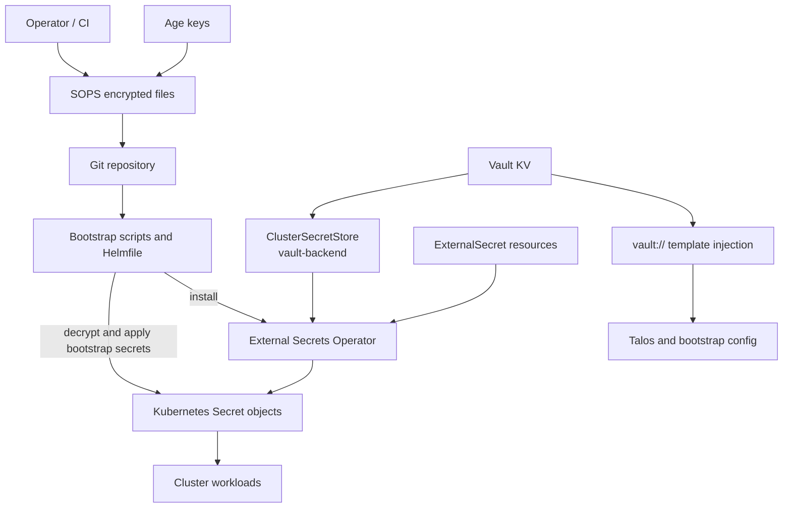

# Secret Management Pattern

This document describes the reusable secret management pattern used across this repository. The pattern combines encrypted Git-stored bootstrap secrets, Vault-backed runtime secret delivery, and template-time Vault injection for selected machine and bootstrap configuration.

## Pattern Overview

- Bootstrap secrets are stored in Git as SOPS-encrypted files and decrypted only at apply time.
- Runtime application secrets are sourced from Vault through `ExternalSecret` resources and materialized as Kubernetes `Secret` objects.
- Some Talos and bootstrap templates resolve `vault://...` placeholders before they are applied, so those values do not need to be committed to Git.

## Core Building Blocks

- `SOPS` protects repository-stored bootstrap secrets.
- `age` keys are used for decryption according to [`.sops.yaml`](../.sops.yaml).
- `Vault` acts as the runtime source of truth for many application and platform secrets.
- `External Secrets Operator` syncs data from Vault into Kubernetes Secrets.
- `ClusterSecretStore` defines the shared Vault backend used by `ExternalSecret` resources.
- `vault://` placeholders are resolved by local tooling during render/apply flows for Talos-related configuration.

## Secret Flows

### 1. Bootstrap Secret Flow

- Sensitive bootstrap files are committed as `*.sops.yaml`.
- During bootstrap, scripts decrypt and apply them directly to the target cluster.
- This is used for early cluster access and foundational credentials before full GitOps reconciliation is available.
- Examples in the repo include bootstrap secrets such as `vault-cluster-creds.sops.yaml`, `age-key.sops.yaml`, and Git-related bootstrap secrets under [`bootstrap/main`](../bootstrap/main).

### 2. Runtime Secret Sync Flow

- Vault stores application and shared platform secrets under structured paths.
- A `ClusterSecretStore` points the cluster to the shared Vault backend.
- `ExternalSecret` resources declare which Vault path to read.
- The operator creates or refreshes Kubernetes `Secret` objects that are then consumed by workloads.
- This pattern keeps application secrets out of Git while still allowing declarative secret wiring.

### 3. Template-Time Vault Injection Flow

- Some Talos and bootstrap templates contain `vault://path#field` placeholders.
- Rendering tools replace those placeholders by reading values directly from Vault before the manifest is applied.
- This is mainly used where values must exist in rendered machine configuration or other pre-cluster resources.

## Typical Repository Pattern

- Encryption rules live in [`.sops.yaml`](../.sops.yaml).
- Bootstrap applies initial secrets with scripts such as [`scripts/bootstrap-talos-apps.sh`](../scripts/bootstrap-talos-apps.sh).
- Vault-backed runtime sync is configured through [`kubernetes/apps/base/external-secrets/clustersecretstore.yaml`](../kubernetes/apps/base/external-secrets/clustersecretstore.yaml).
- A reusable application-level `ExternalSecret` pattern exists in [`kubernetes/components/external-secret/external-secret.yaml`](../kubernetes/components/external-secret/external-secret.yaml).
- Template-time Vault resolution is implemented in [`scripts/vault-inject.py`](../scripts/vault-inject.py).

## Design Intent

- Keep bootstrap-capable secrets available in Git, but encrypted.
- Keep most runtime secrets outside Git and sourced from Vault.
- Reuse the same Vault backend across workloads through a shared cluster store pattern.
- Separate early-cluster secret delivery from steady-state runtime secret synchronization.
- Support multi-cluster reuse by keeping secret lookup paths cluster-aware, for example `${CLUSTER}/${APP}`.
