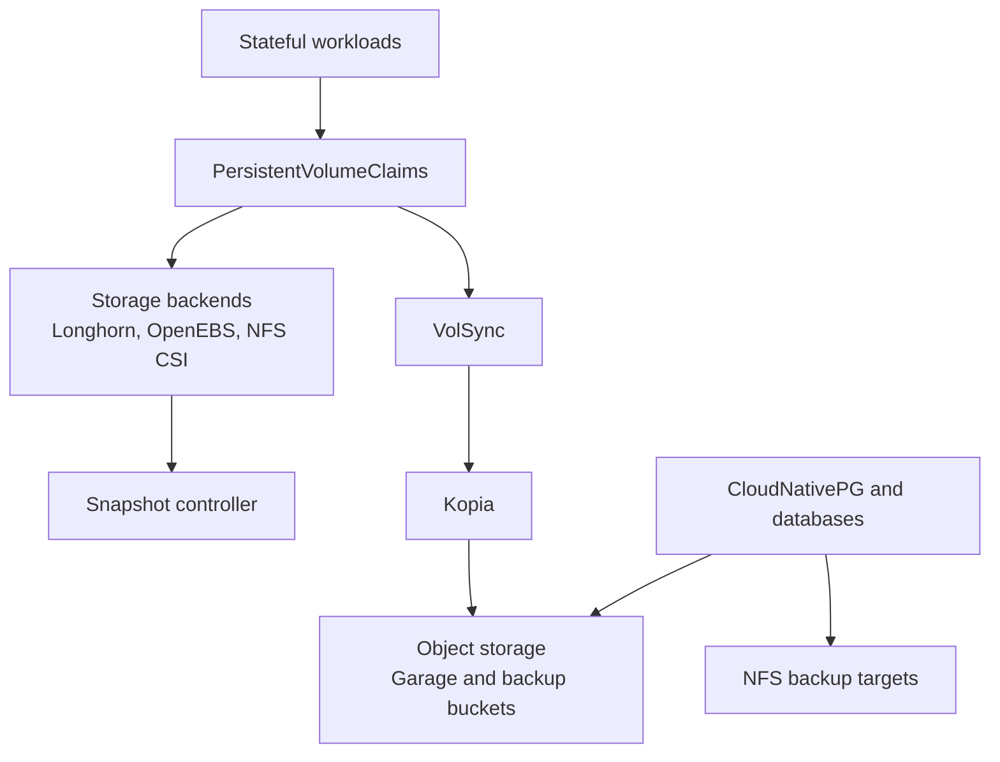

# Storage And Backup Pattern

This document describes the reusable storage and backup pattern used in this repository. The pattern combines cluster storage providers, persistent application volumes, object-backed database backups, and Kopia-based volume replication.

## Pattern Overview

- Stateful workloads mount PVCs backed by one of the cluster storage backends.
- Longhorn, OpenEBS, and NFS CSI cover different persistence and access needs.
- Volume-level backup and replication use VolSync with a Kopia-backed mover.
- Database workloads use dedicated backup mechanisms in addition to normal persistent volumes.
- Object storage and NFS targets are used for backup retention depending on the workload type.

## Core Building Blocks

- `Longhorn` provides primary persistent storage and snapshot integration.
- `OpenEBS` and `NFS CSI` complement the storage stack for different volume classes.
- `snapshot-controller` enables CSI snapshot workflows.
- `VolSync` manages PVC replication and backup workflows.
- `Kopia` acts as the data mover backend for VolSync.
- `Garage` provides object storage used by backup flows.
- Database operators such as `CloudNativePG` define their own backup and restore primitives.

## Storage And Backup Flows

### 1. Persistent Volume Flow

- Applications request PVCs through reusable volume patterns.
- Storage classes determine where and how data is persisted.
- This keeps app deployment declarative while allowing different storage backends per use case.

### 2. Volume Backup And Replication Flow

- VolSync creates replication resources around a PVC.
- The active implementation in this repo is Kopia-backed.
- Snapshot and mover settings are controlled through Flux substitutions and reusable components.
- This pattern is suitable for file-based workload backup and restore flows.

### 3. Database Backup Flow

- Database workloads use operator-native backup features where available.
- CloudNativePG is configured to write backups to object storage using Barman-based integration.
- Additional local-style backup jobs can also write to NFS-mounted backup targets.
- This separates database-consistent backup logic from generic filesystem-level PVC backup.

### 4. Object Storage Flow

- Garage provides S3-compatible object storage inside the platform.
- Backup components consume credentials and target bucket configuration declaratively.
- This enables cluster-local backup destinations for database and potentially volume-related workflows.

## Typical Repository Pattern

- The storage stack entrypoint is [`kubernetes/apps/main/storage/kustomization.yaml`](../kubernetes/apps/main/storage/kustomization.yaml).
- Longhorn is wired through [`kubernetes/apps/main/storage/longhorn.yaml`](../kubernetes/apps/main/storage/longhorn.yaml).
- VolSync is wired through [`kubernetes/apps/main/storage/volsync.yaml`](../kubernetes/apps/main/storage/volsync.yaml).
- Kopia is wired through [`kubernetes/apps/main/storage/kopia.yaml`](../kubernetes/apps/main/storage/kopia.yaml).
- Garage is wired through [`kubernetes/apps/main/storage/garage.yaml`](../kubernetes/apps/main/storage/garage.yaml).
- The reusable VolSync component is documented in [`kubernetes/components/volsync/README.md`](../kubernetes/components/volsync/README.md).

## Design Intent

- Separate storage provisioning from backup orchestration.
- Support multiple storage backends without changing the overall application pattern.
- Use dedicated backup strategies for PVC-based workloads and database workloads.
- Favor reusable components and post-build substitutions over app-specific one-off backup logic.
- Keep the overall pattern portable across clusters, even if individual backends or retention policies differ.
