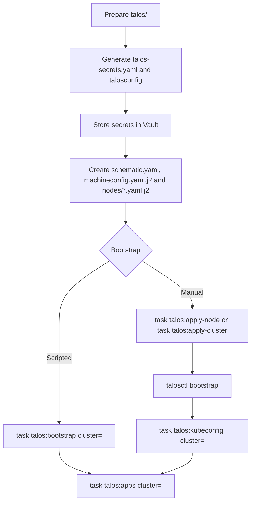

# Talos

This directory contains the Talos base configuration for all clusters in this repository. Each cluster has its own subdirectory, for example `main`, `registry`, or `test`.

## Structure

Each cluster directory under `talos/<cluster>/` usually contains:

- `schematic.yaml`: definition for Talos Image Factory and the required system extensions.
- `machineconfig.yaml.j2`: shared base template for the cluster.
- `nodes/*.yaml.j2`: node-specific patches for hostname, IPs, disk layout, and roles.
- `talosconfig`: generated Talos client configuration used to access the cluster.

The final MachineConfig is not stored permanently. It is rendered on demand from `machineconfig.yaml.j2` and `nodes/*.yaml.j2`. Rendering is handled by [`scripts/render-machine-config.sh`](../scripts/render-machine-config.sh).

## Configuration model

The configuration is split into two layers:

1. `machineconfig.yaml.j2` contains the shared cluster values such as CA certificates, tokens, SANs, registry mirrors, kernel modules, and Kubernetes settings.
2. `nodes/<node>.yaml.j2` contains only the node-specific differences, for example `machine.type`, hostname, static IP, interface, and volumes.

When applying configuration, the base template is rendered with Vault values first and then merged with the node patch.

## New cluster

For a new cluster, create a new directory at `talos/<cluster>/`. At a minimum, it should contain:

- `schematic.yaml`
- `machineconfig.yaml.j2`
- `nodes/<node>.yaml.j2`

Recommended workflow:

1. Create the cluster directory, for example `talos/test/`.
2. Create `schematic.yaml` for the required extensions.
3. Derive `machineconfig.yaml.j2` from an existing cluster and adjust cluster name, endpoint, SANs, and Vault paths.
4. Create one file in `nodes/` for every control plane and worker node.
5. Generate Talos secrets and `talosconfig` once.
6. Store the secrets in Vault.
7. Install the nodes with the rendered MachineConfigs and then bootstrap Kubernetes.



## Example: cluster `test`

### 1. Generate Talos secrets and configuration

```bash
talosctl gen secrets -o talos/test/talos-secrets.yaml
talosctl gen config test https://k8s.test.internal:6443 --with-secrets talos/test/talos-secrets.yaml --output-dir talos/test
```

This creates, among other things:

- `talos/test/talos-secrets.yaml`
- `talos/test/talosconfig`
- temporarily generated `controlplane.yaml` and `worker.yaml`

### 2. Convert secrets to JSON for Vault

This command outputs the JSON payload that can be stored as a secret in Vault.

```bash
yq -o=json '{
  "CLUSTER_ID": .cluster.id,
  "CLUSTER_SECRET": .cluster.secret,
  "CLUSTER_TOKEN": .secrets.bootstraptoken,
  "CLUSTER_SECRETBOXENCRYPTIONSECRET": .secrets.secretboxencryptionsecret,
  "MACHINE_TOKEN": .trustdinfo.token,
  "CLUSTER_ETCD_CA_CRT": .certs.etcd.crt,
  "CLUSTER_ETCD_CA_KEY": .certs.etcd.key,
  "CLUSTER_CA_CRT": .certs.k8s.crt,
  "CLUSTER_CA_KEY": .certs.k8s.key,
  "CLUSTER_AGGREGATORCA_CRT": .certs.k8saggregator.crt,
  "CLUSTER_AGGREGATORCA_KEY": .certs.k8saggregator.key,
  "CLUSTER_SERVICEACCOUNT_KEY": .certs.k8sserviceaccount.key,
  "MACHINE_CA_CRT": .certs.os.crt,
  "MACHINE_CA_KEY": .certs.os.key
}' talos/test/talos-secrets.yaml | jq .
```

For the `test` cluster, these values must be written to `vault://Kubernetes/talos-test`, because [`machineconfig.yaml.j2`](test/machineconfig.yaml.j2) points to that path.

### 3. Set endpoint and node in `talosconfig`

```bash
talosctl --talosconfig talos/test/talosconfig config endpoint cp01.k8s.test.internal
talosctl --talosconfig talos/test/talosconfig config node cp01.k8s.test.internal
```

If the cluster has multiple nodes, you can set multiple values here. The first endpoint is later used for bootstrapping.

### 4. Maintain cluster-specific files

Before bootstrapping, these files should exist in the cluster directory:

- `talos/test/schematic.yaml`
- `talos/test/machineconfig.yaml.j2`
- `talos/test/nodes/cp01.k8s.test.internal.yaml.j2`
- additional `nodes/*.yaml.j2` files for other control planes or workers

The generated default files `controlplane.yaml` and `worker.yaml` are not used further in this repository.

The relevant files are:

- `talos-secrets.yaml` for the one-time Vault import
- `talosconfig` for cluster access
- `schematic.yaml`
- `machineconfig.yaml.j2`
- `nodes/*.yaml.j2`

Once Vault is populated and `talosconfig` is configured correctly, `controlplane.yaml`, `worker.yaml`, and also `talos-secrets.yaml` can be deleted.

`talosconfig` is still needed for `talosctl` and the existing tasks.

## Bootstrapping a new cluster

Once the nodes are installed with the correct Talos image and reachable on the network, you can bootstrap the cluster in one of these ways:

### 1. Bootstrap with the script

```bash
task talos:bootstrap cluster=test
```

This task:

- renders the final MachineConfig for each node,
- tries `apply-config` securely first,
- automatically falls back to `--insecure` for nodes still in maintenance mode,
- bootstraps Kubernetes on the first control plane endpoint,
- fetches `kubeconfig` into `kubernetes/clusters/<cluster>/`

### 2. Alternatively, apply individual nodes

```bash
task talos:apply-node cluster=test node=cp01.k8s.test.internal
task talos:apply-cluster cluster=test
```

### 3. Bootstrap Kubernetes manually

If you want to bootstrap without the script:

```bash
talosctl --talosconfig talos/test/talosconfig --nodes cp01.k8s.test.internal bootstrap
```

#### 3.1 Fetch kubeconfig

If you bootstrap manually without the script, fetch kubeconfig afterwards:

```bash
task talos:kubeconfig cluster=test
```

With the bootstrap script, this step is handled automatically by:

```bash
task talos:bootstrap cluster=test
```

### 4. Deploy initial cluster apps

```bash
task talos:apps cluster=test
```

## Reset and rebuild

To reset a single node:

```bash
talosctl --talosconfig talos/test/talosconfig -n 10.0.60.201 reset --graceful=false
```

Or via the existing tasks:

```bash
task talos:reset-node cluster=test node=cp01.k8s.test.internal
task talos:reset-cluster cluster=test
```

## Notes

- `schematic.yaml` describes the Talos image, not the node configuration.
- `machineconfig.yaml.j2` contains only shared defaults and Vault references.
- Everything node-specific belongs in `nodes/*.yaml.j2`.
